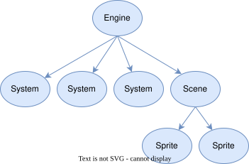

=============
The Game Tree
=============

Games in PursuedPyBear organize their objects into a tree, with the
:class:`Engine` as the root, and then :class:`System` and :class:`Scene`, and
then :class:`Sprite`.

Game Objects
============

All of these are instances of :class:`.GameObject`, which manages things like
tree operations and children searching and such.

Other than the :class:`.Engine` and its direct children, you may structure the
tree however you want. You can define your own game objects and put them in your
scenes (they won't render, but they'll receive events).

Event Dispatch
==============

Events are dispatched breadth first: top to bottom, starting from the
:class:`.Engine`, and then all of the :class:`.System` instances, and then the
:class:`.Scene`, and then their children.

In the above diagram, events would be dispatched in the following order:

1. Engine
2. System
3. System
4. System
5. Scene
6. Sprite
7. Sprite
8. Sprite
